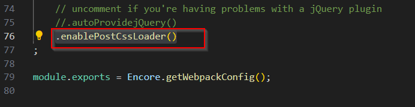
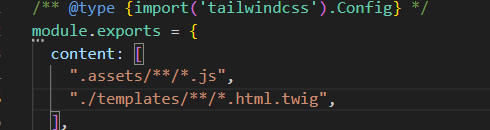
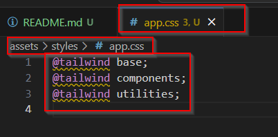

## INSTALLATION
- symfony new (nom du projet) --webapp
- cd (nom du projet)
- composer require symfony/webpack-encore-bundle
- composer require symfony/ux-react
- npm run install --force
- npm install -D tailwindcss postcss autoprefixer postcss-loader
- npm install @babel/preset-react@^7.0.0 --save-dev
# config tailwind
- npx tailwindcss init -p
- Dans webpack.config.js à la fin du fichier : .enablePostCssLoader()

- Dans tailwind.config.js on dit a tailwind où trouver les fichiers a modifier : 
    ".assets/**/*.js",
    "./templates/**/*.html.twig",

- Dans assets/styles/app.css on charge le tailwind pour que ça fonctionne: 
@tailwind base;
@tailwind components;
@tailwind utilities;

# Vérification
- npm run build

# Lancer le serveur symfony
- symfony serve -d
- dans un onglet de navigateur : https://127.0.0.1:8000

