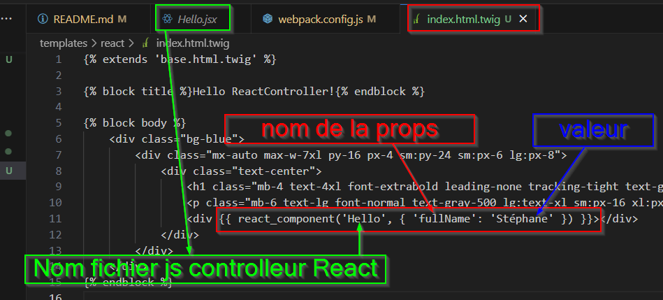

## INSTALLATION
- symfony new (nom du projet) --webapp
- cd (nom du projet)
- composer require symfony/webpack-encore-bundle
- composer require symfony/ux-react
- npm run install --force
- npm install -D tailwindcss postcss autoprefixer postcss-loader
- npm install @babel/preset-react@^7.0.0 --save-dev
# config tailwind
- npx tailwindcss init -p
- Dans webpack.config.js à la fin du fichier : .enablePostCssLoader()

- Dans tailwind.config.js on dit a tailwind où trouver les fichiers a modifier : 
    ".assets/**/*.js",
    "./templates/**/*.html.twig",

- Dans assets/styles/app.css on charge le tailwind pour que ça fonctionne: 
@tailwind base;
@tailwind components;
@tailwind utilities;

# Vérification
- npm run build

# Lancer le serveur symfony
- symfony serve -d
- dans un onglet de navigateur : https://127.0.0.1:8000

# Installer Babel
- npm install @babel/preset-react@^7.0.0 --save-dev
- dans webpack.config.js decommenter .enableReactPreset()

# Suite installation React UX:
- dans assets/app.js ajouter ceci (si il y est pas déjà): // assets/app.js
import { registerReactControllerComponents } from '@symfony/ux-react';
registerReactControllerComponents(require.context('./react/controllers', true, /\\.(j|t)sx?$/));

# Controleur React : 
- ils sont créés dans assets/react/controllers
- c'est eux qui fourniront les codes React à utiliser dans twig

## Voir le résultat dans un navigateur :
- Lancer le server symfony : symfony server:start
- Lancer npmpour qu'il puisse lire le tailwind: npm run watch

## Utilisation dans Twig de React.js
- par exemple dans assets/react/controllers on a créé une props "{fullName}"

- pour l'utiliser dans un fichier twig : 

- Attention tous ce qui sera marqué entre 
ICI
 ne sera pas visible. Ceci n'affiche que le composant React 

## EXEMPLE AVEC UNE MODALE UTILISANT HEADLESS UI REACT

# Installer Headless:
- npm install @headlessui/react
- Dans tailwind.config.js, ajouter : "./assets/react/controllers/*.jsx",

# Création de la modale :
- Dans assets/react/controllers créé un fichier Modal.jsx  qui contiendra la modale
- Dedans ajouter le code trouvé sur cette URL pour la modale : https://headlessui.com/react/dialog
- Ne pas oublié d'ajouter en haut : import React from 'react'
- si on veut que la modale ne soit pas ouverte par defaut il faut passer useState()à false

- pour changer dynamiquement le texte du bouton, on met "props" dans MyModal(), puis dans le bouton on crée une props:

- on fait pareil pour le bouton de la modale ouverte plus bas dans le code
- Dans index.html.twig on affiche le composant React comme avant. Le nom du Fichier(ici 'Modal'), puis le nom de la props (ici 'button') et le texte que l'on veut afficher dans le bouton (ici 'Le bouton de la modal')

